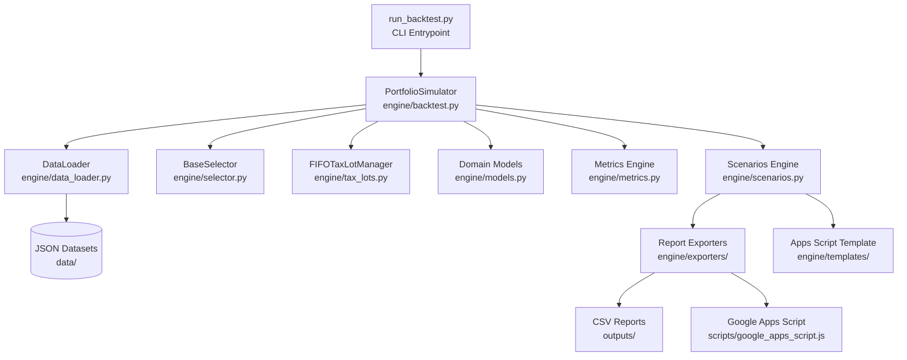
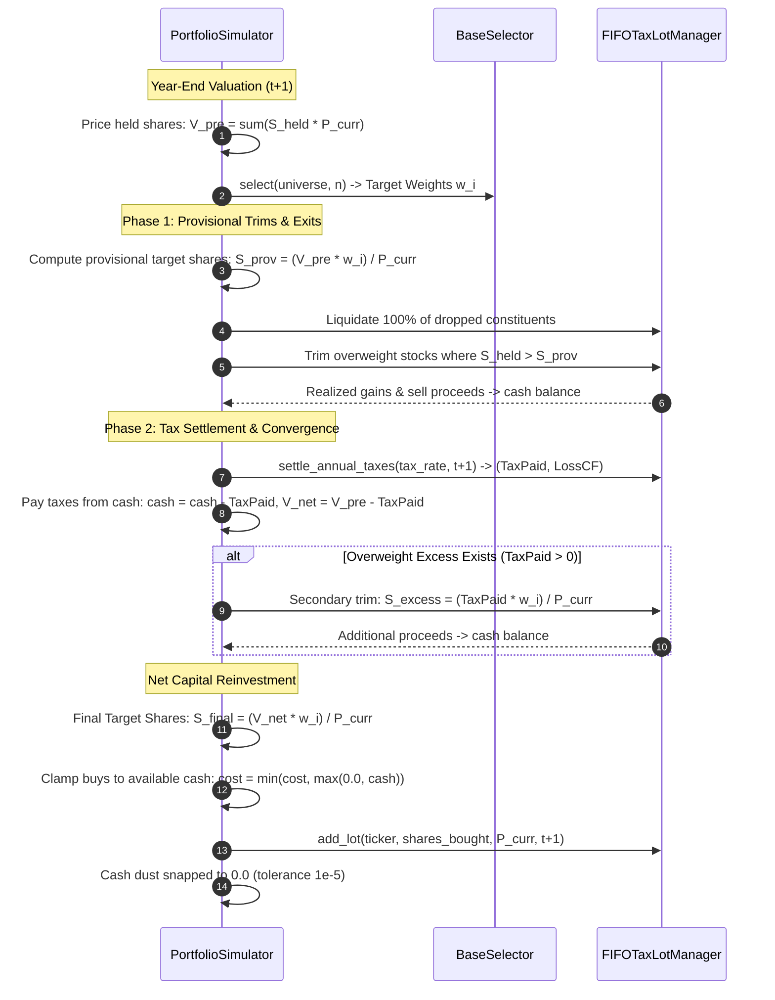

# Architecture Documentation: S&P 500 Top N Strategy Engine

This document outlines the software architecture, quantitative mathematical mechanics, and data structures of the S&P 500 Top N Strategy backtesting engine and reporting suite.

---

## 1. System Overview & Component Hierarchy

The system is decoupled into seven distinct layers, strictly adhering to single-responsibility principles and zero external dependencies (Python 3 standard library only):



### Layer Responsibilities

| Layer / File | Responsibility |
| :--- | :--- |
| [`engine/models.py`](../engine/models.py) | Pure immutable/mutable typed dataclasses (`ConstituentSnapshot`, `HoldingTarget`, `TaxLot`, `TradeOrder`, `AnnualLedgerEntry`, `StrategyResult`). |
| [`engine/data_loader.py`](../engine/data_loader.py) | Loads point-in-time constituent snapshots, split-adjusted close prices (1994–2024), and official `^GSPC` benchmark levels from JSON data stores. |
| [`engine/tax_lots.py`](../engine/tax_lots.py) | Maintains FIFO tax-lot queues per ticker, executes partial lot depletion, accumulates realized gains, and nets gains against prior loss carryforwards. |
| [`engine/selector.py`](../engine/selector.py) | Ranks constituents and calculates target weights normalized to 100% ($w_i = W_i / \sum W_j$). Selector resolution (`resolve_selector`). |
| [`engine/backtest.py`](../engine/backtest.py) | Two-phase rebalance simulation engine enforcing cash neutrality, self-financing, and zero margin debt ($cash \ge 0.0$). |
| [`engine/metrics.py`](../engine/metrics.py) | Pure mathematical calculation of CAGR, Cumulative Return, Max Drawdown, Turnover, Tax Drag, Alpha, and terminal liquidation metrics. |
| [`engine/scenarios.py`](../engine/scenarios.py) | Multi-tier scenario matrix orchestrator (`build_scenario_and_apps_script_data`) across horizons, tax rates, and universes. |
| [`engine/terminal_view.py`](../engine/terminal_view.py) | ASCII terminal presentation formatting (`format_terminal_table`). |
| [`engine/templates/`](../engine/templates/) | Modular Google Apps Script dashboard templates (`gas/00_` to `05_`). |
| [`engine/exporters/`](../engine/exporters/) | Modular export package (`csv.py`, `apps_script.py`, `pipeline.py`). Formats CSV audit files and generates Google Apps Script dashboards. |

---

## 2. Two-Phase Rebalancing Mechanics & Tax Settlement

A naive rebalancing algorithm suffers from circular dependency when capital gains taxes are involved:
1. Selling overweight stocks creates capital gains taxes.
2. The tax liability reduces net investable equity.
3. Lower net equity changes the dollar targets for all positions, altering required sell amounts.

To resolve this circularity while guaranteeing **strict self-financing without unmodeled margin leverage ($cash \ge 0.0$)**, the engine executes a deterministic two-phase rebalancing cycle:



### Mathematical Proof of Self-Financing & Exact Target Weights
Let $V_{\text{pre}} = \sum_i S_i P_i$ be pre-tax portfolio equity.  
Let $T$ be the tax liability determined by sales.  
The net investable equity is $V_{\text{net}} = V_{\text{pre}} - T$.

1. Overweight holdings were provisionally trimmed to $V_{\text{pre}} w_i$.  
2. Their final target is $V_{\text{net}} w_i = (V_{\text{pre}} - T) w_i = V_{\text{pre}} w_i - T w_i$.  
3. Trimming the excess shares releases proceeds equal to:
   $$\sum_{i \in \text{Overweight}} T w_i = T \sum_{i \in \text{Overweight}} w_i$$
4. Adding these proceeds to remaining cash $(\text{GrossProceeds} - T)$ provides the exact cash needed to purchase all underweight holdings up to $V_{\text{net}} w_j$:
   $$\text{Cash Available} = \sum_{j \in \text{Underweight}} (V_{\text{net}} w_j - V_{\text{held}, j})$$
5. As a result, every position exactly achieves target weight $w_k$, portfolio value equals $V_{\text{net}}$, and residual cash is precisely $0.0$.

---

## 3. FIFO Tax-Lot Accounting Model

Each asset purchase creates an immutable `TaxLot(lot_id, ticker, shares, purchase_price, purchase_year, purchase_quarter)`.

When shares are sold:
1. **FIFO Depletion**: The earliest purchase lots are depleted first.
2. **Partial Lot Splits**: If a sale depletes a fraction of a lot, the sold fraction is logged with realized capital gain $(P_{\text{sell}} - P_{\text{buy}}) \times \text{shares}$, while remaining shares stay in the lot with unchanged purchase price and period.
3. **Loss Carryforward Netting**:
   $$NetTaxableGain_{t+1} = RealizedGain_{t+1} - LossCarryforward_{t}$$
   - If $NetTaxableGain_{t+1} > 0$: $TaxPaid = NetTaxableGain_{t+1} \times \tau$, $LossCarryforward_{t+1} = 0$.
   - If $NetTaxableGain_{t+1} \le 0$: $TaxPaid = 0$, $LossCarryforward_{t+1} = |NetTaxableGain_{t+1}|$.
4. **Terminal Liquidation**:
   Embedded unrealized gain is computed across all remaining lots:
   $$UnrealizedGain = \sum_{\text{lots}} (P_{\text{terminal}} - P_{\text{buy}}) \times \text{shares}$$
   Terminal tax nets against any accumulated loss carryforward:
   $$TerminalTax = \max(0.0, UnrealizedGain - LossCarryforward) \times \tau$$
   $$PostLiquidationWealth = PreLiquidationWealth - TerminalTax$$

---

## 4. Quarterly Rebalancing & Dynamic Weight Drift

In addition to annual rebalancing, the engine supports **quarterly rebalancing** ($N \in \{3, 5, 10\}$):
1. **Discrete Quarterly Dividend Pooling**: Split-adjusted dividends paid across the quarter are collected directly from `data/sp500_quarterly_dividends.json` (or `world_quarterly_dividends.json`) into cash at the end of each quarter (March 31, June 30, September 30, December 31).
2. **Dynamic Weight Drift (Q1–Q3)**: Constituent weights drift dynamically based on price performance relative to the index:
   $$W_{i, q} = W_{i, 0} \times \frac{P_{i, q} / P_{i, 0}}{P_{\text{index}, q} / P_{\text{index}, 0}}$$
   Target holdings are re-ranked and rebalanced to $w_{i, q} = W_{i, q} / \sum_{j=1}^N W_{j, q}$.
3. **Q4 Factsheet Re-Anchoring**: At the end of Q4 (December 31), constituent weights and universe rankings re-anchor directly to official annual factsheets, eliminating multi-year cumulative drift error.
4. **Pluggable Dataset Ingestion**: [`DataLoader.load_quarterly_universe()`](../engine/data_loader.py) supports external point-in-time constituent files. If a third-party dataset is dropped into `data/`, the engine uses it automatically; otherwise it computes dynamic drift.

---

## 5. Pluggable Factor Selection

New quantitative selection models extend [`BaseSelector`](../engine/selector.py):

```python
from engine.selector import BaseSelector
from engine.models import ConstituentSnapshot, HoldingTarget
from typing import Sequence, List, Optional

class CustomQualitySelector(BaseSelector):
    def select(
        self, universe: Sequence[ConstituentSnapshot], n: Optional[int] = None
    ) -> List[HoldingTarget]:
        eff_n = self.n if n is None else n
        # Filter and rank universe
        ranked = sorted(universe, key=lambda c: c.market_cap_weight, reverse=True)[:eff_n]
        # Normalize weights
        weights = self._compute_weights(ranked, self.weight_by)
        return [HoldingTarget(ticker=c.ticker, target_weight=w) for c, w in zip(ranked, weights)]
```

---

## 6. Google Sheets Dynamic Integration Architecture

The generated [`scripts/google_apps_script.js`](../scripts/google_apps_script.js) utilizes a multi-tier data pipeline:

1. **Pre-Computed Scenario Matrix**: Simulations for standard tax brackets ($0.0\%, 15.0\%, 20.0\%, 30.0\%, 37.0\%$) across all horizons, universes (`S&P 500`, `All World`), strategies (`Top 3`, `Top 5`, `Top 10`), and rebalancing frequencies (`Annual`, `Quarterly`) are embedded into the 17-column `Scenario Data` sheet.
2. **Interactive Dropdown Controls (Row 2)**:
   - Tax Rate (`B2`), Universe (`D2`), Strategy (`F2`), Horizon (`H2`), Compare Index (`J2`), and Rebalance Frequency (`L2`: `All`, `Annual Only`, `Quarterly Only`).
3. **Spill-Safe Comparative Table (Rows 10–77)**:
   - Executive Summary displays a 14-column table (`Universe`, `Horizon`, `Strategy`, `Frequency`, `Annual Return (Pre-Tax)`, ...).
   - Dynamic `FILTER` formula handles both strategy rows and benchmark comparisons without `#SPILL!` errors by reserving Rows 10–77 completely unmerged.
   - Glossary and Methodology cards are positioned at **Row 80+**.
4. **Decoupled KPI Scorecards (Rows 4–6)**:
   - Scorecards query `Scenario Data` via `{horizon}_{universe}_{strategy}_{freq}_{tax_rate}` composite keys and automatically reflect frequency and tax rate changes.
5. **On-Demand Custom Recalculation**: A custom Google Apps Script function `RECALCULATE_STRATEGY(customRate)` is included for non-standard tax rates (e.g. $24.5\%$).
